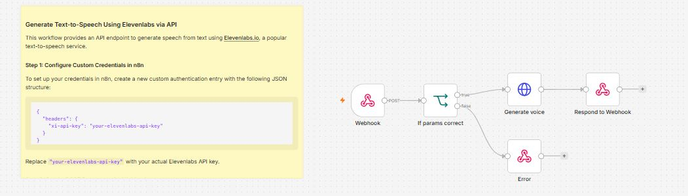

# 🎙️ Text-to-Speech API using n8n & ElevenLabs


---

# 📖 Overview

This workflow provides a simple REST API built with **n8n** that converts text into natural-sounding speech using the **ElevenLabs Text-to-Speech API**.

Instead of directly integrating ElevenLabs into every application, this workflow acts as a reusable API layer. Clients can send a POST request containing text, voice ID, and model information to the webhook endpoint, and the workflow validates the request before forwarding it to ElevenLabs.

If all required parameters are present, the workflow generates speech and returns the audio response to the client. If validation fails, a structured error response is returned.

This architecture makes it easy to integrate AI voice generation into websites, mobile applications, chatbots, automation workflows, and other external systems.

---
# 🖼️ Workflow Layout



# ✨ Features

* 🎙️ Convert text into realistic speech
* 🌐 REST API endpoint using Webhook
* ⚡ Fast HTTP-based execution
* 🔍 Request parameter validation
* 🎯 Custom voice selection
* 🧠 Support for ElevenLabs AI voice models
* 📦 JSON request and response handling
* 🚦 Conditional routing with IF node
* ❌ Structured error handling
* 🔄 Easy integration with third-party applications

---

# 💼 Business Problem Solved

Many applications require high-quality voice generation but integrating directly with the ElevenLabs API can involve repetitive setup, authentication, and validation logic.

This workflow simplifies the process by:

* Providing a reusable REST API endpoint
* Validating incoming requests before processing
* Centralizing ElevenLabs API integration
* Returning consistent success and error responses
* Reducing development effort for multiple applications

It can serve as a backend service for AI assistants, accessibility tools, content creators, customer support systems, and automation platforms.

---

# 🛠️ Technologies Used

| Technology     | Purpose                         |
| -------------- | ------------------------------- |
| n8n            | Workflow automation platform    |
| ElevenLabs API | AI text-to-speech generation    |
| Webhook        | REST API endpoint               |
| HTTP Request   | Send requests to ElevenLabs     |
| IF Node        | Validate incoming parameters    |
| JSON           | API request and response format |

---

# 📁 Repository Structure

```text
n8n-elevenlabs-text-to-speech-api/
│
├── README.md
├── workflow.json
├── LICENSE
├── .gitignore
│
├── sample-data/
│   ├── sample-request.json
│   ├── sample-response.json
│   ├── sample-error.json
│   └── sample-api.md
│
└── images/
    └── api-demo.png
```

> **Note:** The `images` folder is optional. Since you're skipping the workflow diagram for now, you can leave it empty or add API screenshots later.

---

# 🔧 Prerequisites

Before importing the workflow into n8n, make sure you have:

* n8n (latest version)
* ElevenLabs account
* ElevenLabs API Key
* Public webhook URL (or local tunnel using ngrok for testing)
* Internet connection

---

# 🔐 Required Credentials

## 🎙️ ElevenLabs API

### Required

* ElevenLabs API Key

### Used For

* Text-to-Speech generation
* Voice synthesis

### Authentication Method

Custom Header Authentication

Example:

```http
xi-api-key: YOUR_ELEVENLABS_API_KEY
```

---

# 🌐 API Endpoint

After activating the workflow, n8n exposes a Webhook endpoint similar to:

```text
POST https://your-n8n-instance/webhook/text-to-speech
```

Replace the URL with your own n8n webhook endpoint.

---

# 📥 Expected Request Body

The API accepts a JSON payload such as:

```json
{
  "text": "Welcome to our AI-powered voice generation service.",
  "voice_id": "21m00Tcm4TlvDq8ikWAM",
  "model_id": "eleven_multilingual_v2"
}
```

### Request Parameters

| Parameter | Type   | Required | Description                 |
| --------- | ------ | -------- | --------------------------- |
| text      | String | ✅        | Text to convert into speech |
| voice_id  | String | ✅        | ElevenLabs Voice ID         |
| model_id  | String | Optional | Voice model to use          |

---

# 📤 Successful Response

If the request is valid, the workflow returns:

* Generated speech audio (typically MP3)
* HTTP Status: **200 OK**

Depending on your configuration, the response may be binary audio or a downloadable file.

---

# ❌ Error Response

If required parameters are missing, the workflow returns a structured JSON error similar to:

```json
{
  "success": false,
  "message": "Required parameters are missing.",
  "status": 400
}
```

---

# 🚀 Installation

## 1️⃣ Import the Workflow

Import `workflow.json` into your n8n instance.

---

## 2️⃣ Create ElevenLabs Credential

In n8n:

* Go to **Credentials**
* Create a **Custom Header Authentication** credential
* Add your ElevenLabs API key

Example header:

```http
xi-api-key: YOUR_ELEVENLABS_API_KEY
```

---

## 3️⃣ Configure the HTTP Request Node

Update the following:

* ElevenLabs endpoint
* Voice ID (optional)
* Model ID (optional)
* Authentication credential

---

## 4️⃣ Configure the Webhook

Choose a webhook path such as:

```text
text-to-speech
```

Method:

```text
POST
```

---

## 5️⃣ Test the Workflow

Use Postman, Insomnia, curl, or another HTTP client to send a POST request to the webhook with a valid JSON payload.

---

## 6️⃣ Activate the Workflow

Once testing is complete, activate the workflow so the webhook remains available for incoming requests.

---

# ⚡ Workflow Execution

When a client sends a POST request to the webhook, the workflow first validates the incoming JSON payload. If all required parameters are present, the request is forwarded to the ElevenLabs Text-to-Speech API using an HTTP Request node.

The generated audio is then returned to the client through the Respond to Webhook node. If validation fails, the workflow immediately returns a structured error response without making an API call to ElevenLabs.

This validation-first approach helps reduce unnecessary API usage and provides consistent feedback to client applications.

---

# 📚 Node-by-Node Documentation

This section explains every node used in the workflow, its purpose, configuration, inputs, outputs, and how data flows through the automation.

---

# 1️⃣ 🌐 Webhook

**Node Type:** Webhook

## 🎯 Purpose

The **Webhook** node serves as the public REST API endpoint for the workflow. It receives HTTP POST requests from external applications and starts the workflow execution.

This node allows applications such as websites, mobile apps, chatbots, automation platforms, or backend services to request AI-generated speech by sending text and voice parameters.

---

### ⚙️ Configuration

| Parameter      | Value                                 |
| -------------- | ------------------------------------- |
| HTTP Method    | POST                                  |
| Path           | `/text-to-speech`                     |
| Response Mode  | Respond to Webhook Node               |
| Authentication | Optional (recommended for production) |

---

### 📥 Expected Request Body

```json
{
  "text": "Welcome to our AI-powered voice generation service.",
  "voice_id": "21m00Tcm4TlvDq8ikWAM",
  "model_id": "eleven_multilingual_v2"
}
```

---

### 📤 Output

The Webhook node forwards the incoming JSON payload to the validation node.

---

# 2️⃣ 🔀 IF (Validate Parameters)

**Node Type:** IF

## 🎯 Purpose

This node validates that all required parameters are present before making a request to ElevenLabs.

If validation succeeds, the workflow continues.

If validation fails, an error response is returned immediately.

---

### ✅ Validation Rules

Required fields:

* text
* voice_id

Optional:

* model_id

---

### True Branch

* Call ElevenLabs API
* Generate speech
* Return audio

---

### False Branch

* Return error response
* Stop workflow execution

---

### Example Validation

Input:

```json
{
  "text": "Hello",
  "voice_id": "21m00Tcm4TlvDq8ikWAM"
}
```

Validation Result:

```text
TRUE
```

---

Missing field example:

```json
{
  "text": "Hello"
}
```

Validation Result

```text
FALSE
```

---

# 3️⃣ 🎙️ HTTP Request (Generate Voice)

**Node Type:** HTTP Request

## 🎯 Purpose

This node communicates directly with the ElevenLabs API and generates speech from the supplied text.

---

### 🌐 API Endpoint

```text
https://api.elevenlabs.io/v1/text-to-speech/{voice_id}
```

---

### HTTP Method

```text
POST
```

---

### Authentication

Header Authentication

```http
xi-api-key: YOUR_ELEVENLABS_API_KEY
```

---

### Request Headers

| Header       | Value            |
| ------------ | ---------------- |
| xi-api-key   | YOUR_API_KEY     |
| Content-Type | application/json |
| Accept       | audio/mpeg       |

---

### Request Body

```json
{
  "text": "Welcome to our platform.",
  "model_id": "eleven_multilingual_v2"
}
```

---

### Important Parameters

| Parameter        | Description                   |
| ---------------- | ----------------------------- |
| text             | Text to convert into speech   |
| voice_id         | Voice to be used              |
| model_id         | AI speech model               |
| stability        | Voice stability *(optional)*  |
| similarity_boost | Voice similarity *(optional)* |

---

### Output

Returns:

* Binary MP3 Audio
* HTTP Status 200

---

# 4️⃣ 📤 Respond to Webhook

**Node Type:** Respond to Webhook

## 🎯 Purpose

Returns the generated speech back to the client application.

Instead of storing the file inside n8n, this node streams the generated audio directly to the API caller.

---

### Response

Success

```text
HTTP 200
```

Body

```text
Binary MP3 Audio
```

---

Client applications can immediately:

* Play audio
* Download audio
* Store audio
* Forward audio

---

# 5️⃣ ❌ Error Response

**Node Type:** Respond to Webhook

## 🎯 Purpose

Returns a standardized error message when request validation fails.

---

### Example Response

```json
{
    "success": false,
    "message": "Missing required parameter: voice_id",
    "status": 400
}
```

---

Benefits

* Consistent API response
* Easier debugging
* Saves ElevenLabs API credits
* Prevents unnecessary requests

---

# 🔄 Workflow Summary

```text
POST Request
      │
      ▼
Webhook
      │
      ▼
Validate Request
      │
 ┌────┴────┐
 │         │
Valid   Invalid
 │         │
 ▼         ▼
Generate   Error
Speech
 │
 ▼
Respond to Client
```

---

# 🌐 ElevenLabs API Configuration

## Base URL

```text
https://api.elevenlabs.io
```

---

## Endpoint

```text
POST /v1/text-to-speech/{voice_id}
```

---

## Authentication

Header

```http
xi-api-key: YOUR_API_KEY
```

---

## Content-Type

```http
application/json
```

---

## Accept

```http
audio/mpeg
```


---

# 🌍 Use Cases

### 🎥 YouTube Automation

Generate AI narration for videos automatically.

### 🎙️ Podcast Generation

Convert written scripts into natural speech.

### 📚 E-learning Platforms

Generate educational voiceovers.

### ♿ Accessibility Applications

Convert text into speech for visually impaired users.

### 🤖 AI Chatbots

Enable voice responses for conversational AI.

### 📞 Customer Support

Generate automated spoken responses for IVR systems.

### 📱 Mobile Applications

Provide voice playback for text content.

### 📰 News Readers

Read articles aloud using AI-generated voices.

---

# 🎯 Benefits

* Eliminates manual voice recording
* High-quality AI-generated speech
* Easy REST API integration
* Centralized voice generation service
* Reusable across multiple projects
* Scalable and customizable

---

# 🛠️ Customization Ideas

* 🌍 Support multiple languages
* 🎭 Dynamic voice selection
* ⚡ Voice speed controls
* 🎚️ Stability and similarity tuning
* 💾 Store generated audio in cloud storage
* 📂 Save audio to Google Drive or AWS S3
* 📧 Email generated audio automatically
* 💬 Integrate with Telegram or WhatsApp bots

---

# ⚠️ Troubleshooting

| Problem                | Cause                  | Solution                         |
| ---------------------- | ---------------------- | -------------------------------- |
| 401 Unauthorized       | Invalid API key        | Verify ElevenLabs credentials    |
| 400 Bad Request        | Missing request fields | Validate input JSON              |
| Webhook not responding | Workflow inactive      | Activate the workflow            |
| No audio returned      | Invalid voice ID       | Use a valid ElevenLabs voice     |
| API rate limit         | Too many requests      | Retry later or upgrade your plan |

---

# 🚀 Future Improvements

* 🎵 Support WAV and PCM output formats
* 🌍 Automatic language detection
* 🎭 Voice cloning integration
* 📈 Usage analytics dashboard
* 🔒 API key authentication for clients
* 📦 Batch text processing
* ☁️ Cloud storage integration
* 🔊 SSML (Speech Synthesis Markup Language) support

---

# 🤝 Contributing

Contributions, suggestions, and feature requests are welcome. Feel free to fork this repository and submit a pull request.

---

# ⭐ Support

If you found this workflow useful, consider giving the repository a **⭐ Star** on GitHub. It helps others discover the project and supports future workflow development.
